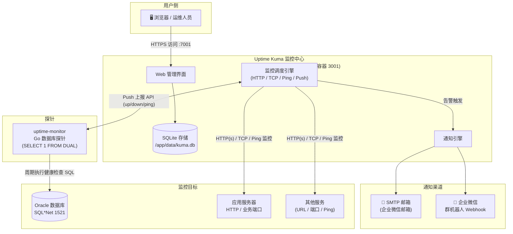
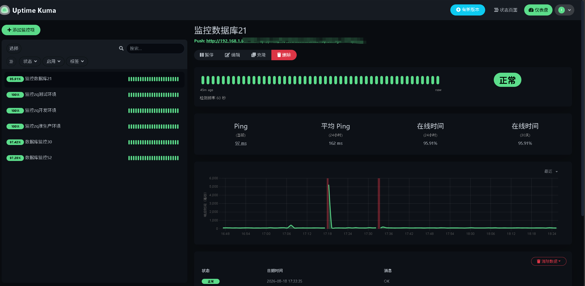
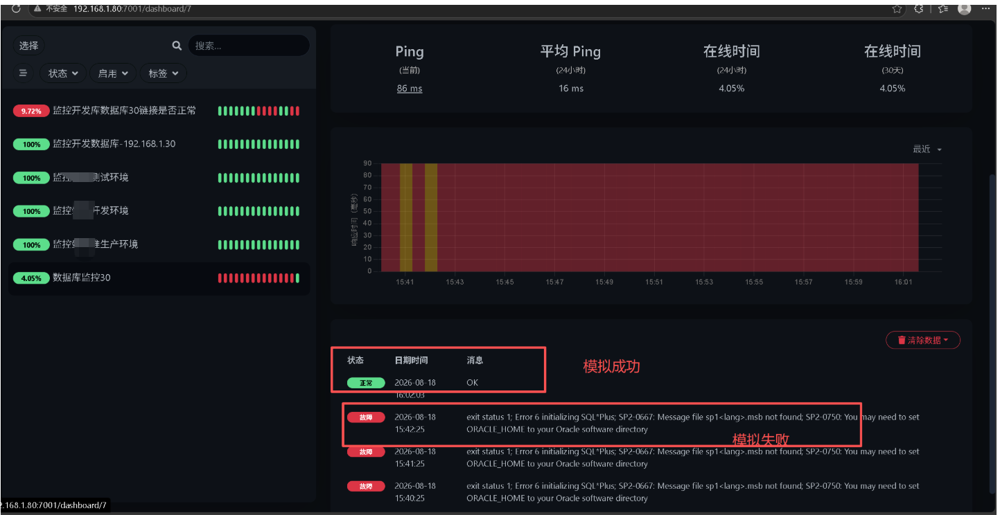
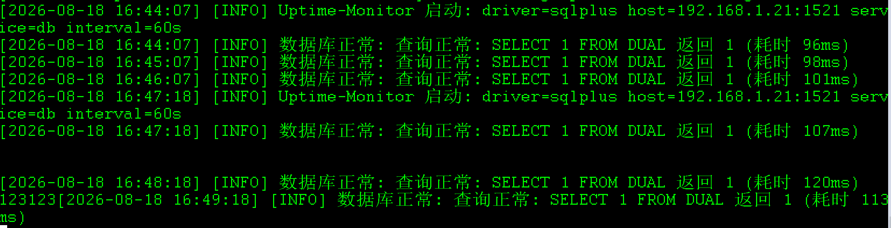
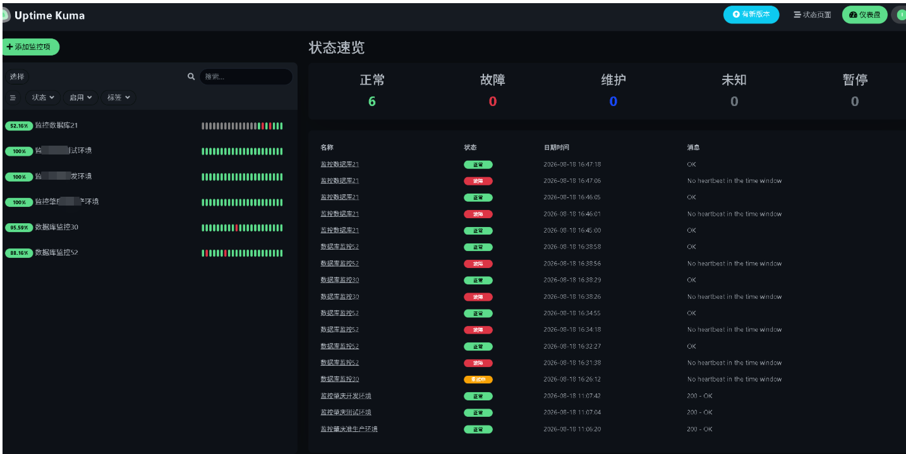
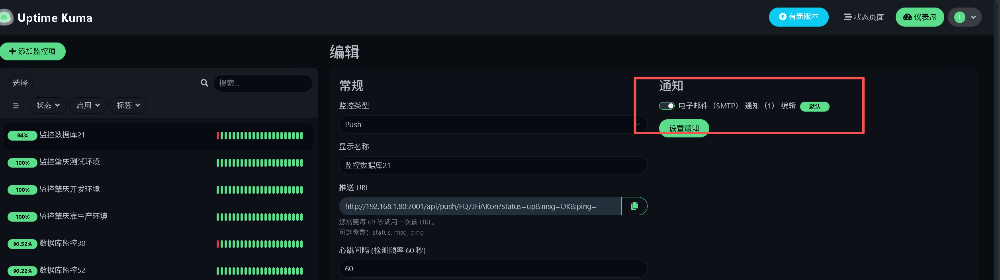
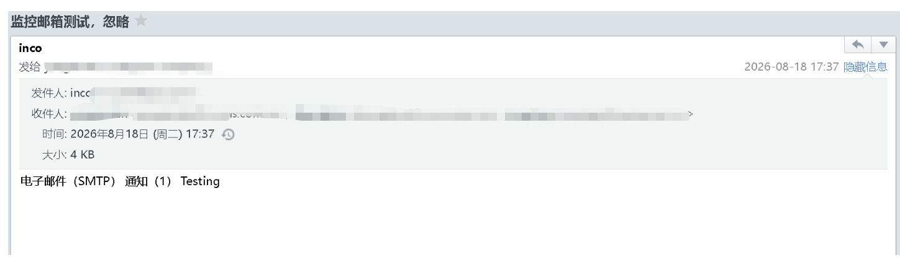

# 📡 Uptime Kuma 监控平台 — 数据库与应用服务器监控方案

> **一站式监控**：数据库探针 + 应用监控 + 告警通知（SMTP 邮件 / 企业微信）

---

## 📌 快速入口

| 项目 | 地址 |
| ---- | ---- |
| 🌐 监控面板 | <http://127.0.0.1:7001/> |
| 🐙 探针开源仓库 | <https://github.com/pslinux/uptime-monitor.git> |

---

## 📋 目录

1. [技术架构](#一技术架构)
2. [Uptime Kuma 安装部署](#二uptime-kuma-安装部署)
3. [组件与职责](#三组件与职责)
4. [监控配置](#四监控配置)
5. [告警通知](#五告警通知)
6. [验证与截图](#六验证与截图)
7. [附录：常见问题 FAQ](#附录常见问题-faq)

---

## 一、技术架构

### 1.1 架构总览



### 1.2 链路说明

- **🔗 数据库监控**：`uptime-monitor` 探针周期性连接 Oracle 执行 `SELECT 1 FROM DUAL`，结果通过 Uptime Kuma **Push API** 上报（`status=up|down` + 延迟），由 Kuma 负责展示与告警。Oracle 本身不支持 HTTP 探活，故由 Go 探针桥接。
- **🌍 应用监控**：直接由 Kuma 的 HTTP(s) / TCP / Ping 类型探测 URL、端口、主机存活，无需额外探针。
- **🔔 通知**：监控状态变化（down / up）时由 Kuma 通知引擎通过 SMTP 邮箱或企业微信机器人推送。

---

## 二、Uptime Kuma 安装部署

> 环境：Docker（或 Node.js ≥ 14），当前部署于 `127.0.0.1:7001`。

### 2.1 Docker 一键部署（推荐）

```bash
# 端口映射 7001(宿主机):3001(容器), 数据持久化到宿主机 /opt/uptime-kuma/data
docker run -d --name uptime-kuma --restart=always \
  -p 7001:3001 \
  -v /opt/uptime-kuma/data:/app/data \
  louislam/uptime-kuma:1

# 确认运行状态
docker ps | grep uptime-kuma
```

### 2.2 首次初始化

1. 浏览器访问 <http://127.0.0.1:7001/>
2. 创建管理员账号（**第一个账号即管理员**，负责配置监控与通知）
3. 数据自动保存于 SQLite：`/opt/uptime-kuma/data/kuma.db`

### 2.3 常用运维命令

| 操作 | 命令 |
| ---- | ---- |
| 查看日志 | `docker logs -f uptime-kuma` |
| 重启 | `docker restart uptime-kuma` |
| 停止 | `docker stop uptime-kuma` |
| 升级 | `docker pull louislam/uptime-kuma:1` 后按下方流程重建 |
| 备份 | 直接拷贝 `/opt/uptime-kuma/data/` 目录（含 kuma.db） |
| 卸载 | `docker rm -f uptime-kuma` |

### 2.4 平滑升级（保留数据）

```bash
docker pull louislam/uptime-kuma:1
docker stop uptime-kuma
docker rm uptime-kuma
docker run -d --name uptime-kuma --restart=always \
  -p 7001:3001 \
  -v /opt/uptime-kuma/data:/app/data \
  louislam/uptime-kuma:1
```

---

## 三、组件与职责

| 组件 | 角色 | 说明 |
| ---- | ---- | ---- |
| **Uptime Kuma** | 监控中心 | 负责展示、调度、告警与通知分发；数据存 SQLite |
| **uptime-monitor** | 数据库探针 | Go 后端，周期探测 Oracle `SELECT 1 FROM DUAL`，经 Push API 上报 |
| **SMTP 邮箱** | 告警渠道 | 企业微信邮箱发信，异常/恢复时邮件通知 |
| **企业微信机器人** | 告警渠道 | 群机器人 Webhook 推送（需管理员权限） |

---

## 四、监控配置

### 4.1 监控范围

- **数据库**：Oracle 实例可用性（Push 类型监控）
- **应用**：URL 地址、业务端口、主机存活

### 4.2 数据库监控（Push 类型）

1. 登录 Uptime Kuma → **添加新监控**
2. 监控类型选择 **Push**
3. 设置心跳间隔（如 60 秒）与状态保留时长（如 10–20 分钟）
4. 复制生成的 Push URL（含 token），填入探针配置的 `push.url`：

```yaml
push:
  url: "http://127.0.0.1:3001/api/push/YOUR_PUSH_TOKEN"
```

5. 探针按间隔自动上报，Kuma 收不到心跳即判定 **DOWN** 并触发告警。

### 4.3 应用监控（HTTP / TCP / Ping）

| 监控类型 | 适用场景 |
| -------- | -------- |
| HTTP(s) | Web 应用、URL 可达性、状态码 |
| TCP 端口 | 应用服务端口连通性 |
| Ping | 主机存活 |

直接添加监控并填入目标地址即可，无需额外探针。

---

## 五、告警通知

> 说明：通知配置仅 **管理员账号** 可见；企业微信 Webhook 需管理员权限，当前采用 **邮箱方式**。

### 5.1 邮件通知（SMTP）

1. 企业邮箱网页端 → 设置 → 收发信设置 → 开启 **SMTP 服务**
2. 设置 → 安全设置 → 生成**客户端专用密码**（授权码，仅显示一次）
3. Uptime Kuma → 设置 → 通知 → 添加通知 → **Email (SMTP)**

| 字段 | 值 |
| ---- | ---- |
| Hostname | `smtp.exmail.qq.com` |
| Port | `465` |
| Security | `SSL/TLS` |
| Username | 企业邮箱完整地址 |
| Password | 客户端专用密码（非登录密码） |
| From Email | 发信邮箱地址 |
| To Email | 收件人邮箱（可多个，逗号分隔） |

> 若 465 被网络拦截，可改用 `587` + `STARTTLS`；填写后先点 **Test** 验证发信。

### 5.2 企业微信 Webhook（备选）

```bash
# Webhook 地址格式
https://qyapi.weixin.qq.com/cgi-bin/webhook/send?key=YOUR_KEY
```

- Uptime Kuma 新版通知选 **企业微信 / WeCom**，填入 URL 即可
- 消息支持占位符：`{{name}}` `{{status}}` `{{msg}}` `{{time}}`
- ⚠️ 群机器人限 **20 条 / 分钟**

### 5.3 选择建议

| 场景 | 推荐 |
| ---- | ---- |
| 有管理员权限 | 企业微信 Webhook（群内实时触达） |
| 无管理员权限 | SMTP 邮箱（本方案当前采用） |

---

## 六、验证与截图

### 6.1 监控列表（数据库 + URL）



### 6.2 监控详情



### 6.3 后台探针日志（uptime-monitor）



### 6.4 仪表盘



### 6.5 邮箱通知配置



### 6.6 连通性测试



---

## 附录：常见问题 FAQ

| 现象 | 原因 / 处理 |
| ---- | ---- |
| 页面显示 `No heartbeat in the time window` | 心跳间隔与保留时长不匹配：把心跳间隔设为探针上报周期，保留时长大于间隔 |
| Push 上报 404 | 检查 Push URL 是否带多余查询串（`?status=...`），只保留 `.../api/push/<token>` |
| `SP2-0667: Message file sp1<lang>.msb not found` | sqlplus 缺 ORACLE_HOME：配置 `db.oracle_home` 指向 Instant Client 目录 |
| `ORA-01017: invalid username/password` | 数据库账号密码错误：核对 `conf/config.yaml` 与 systemd 的 `UM_DB_PASSWORD` |
| 收不到告警邮件 | 检查 SMTP 授权码是否正确、端口 465/587 是否放行、监控是否勾选了通知 |

---

> 📄 相关文档：[部署文档](docs/deploy.md) ｜ [需求文档](docs/requirement.md)
